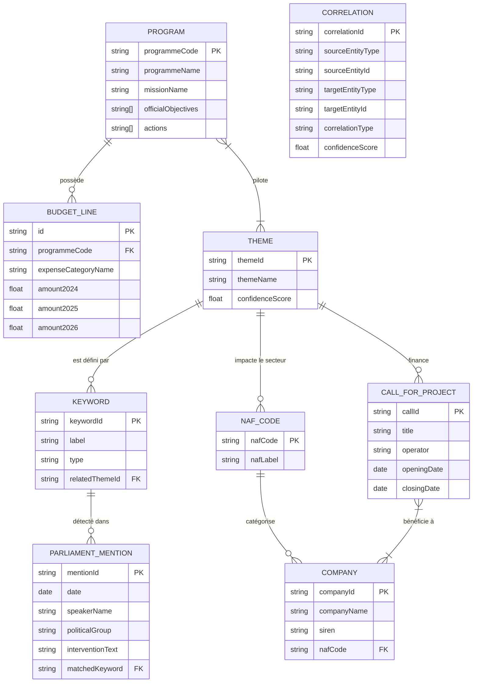

# Architecture et Stratégie d'Acquisition des Données (DATASETS)

Ce document présente l'architecture relationnelle des jeux de données du projet **France 2030** et détaille la stratégie d'acquisition (scraping, API, parsing) pour fiabiliser chaque ressource.

---

## 📊 1. Modèle de Données (Schéma Mermaid)

Voici le diagramme Entité-Association (ERD) représentant les relations entre les différents fichiers JSON générés.

---

## 🕵️ 2. Stratégie d'Acquisition et Extraction (Le "Comment")

Pour passer des données *mockées* aux données **réelles**, voici la feuille de route technique d'acquisition pour chaque jeu de données.

### 💰 A. Programmes et Lignes Budgétaires (`programs.json`, `budget_lines.json`)
- **La Cible** : Obtenir les montants exacts en euros (exécutés, votés, prévus).
- **La Source** : Fichiers Open Data officiels du **PLF 2026** (ou 2025) présents sur `data.gouv.fr` ou la documentation budgétaire de `budget.gouv.fr`. Généralement un fichier CSV nommé "Dépenses du Budget Général".
- **La Méthode** :
  1. Utilisation de `pandas` en Python.
  2. Filtrage du dataset sur la colonne `Mission == "Investir pour la France de 2030"`.
  3. Agrégation (`groupby`) par `Programme` (421 à 425) et par `Catégorie de dépense` (Titre 3, Titre 6).
  4. Conversion des montants bruts en JSON.

### 📄 B. Contenu Qualitatif des Programmes (`programs.json` mis à jour)
- **La Cible** : Récupérer le contexte (objectifs, indicateurs, dispositifs).
- **La Source** : Les documents **Projets Annuels de Performances (PAP)**, au format PDF.
- **La Méthode** :
  1. Script de téléchargement automatique des PDF via `requests`.
  2. Utilisation de la librairie Python `pdfplumber` (ou `PyMuPDF`) pour extraire le texte brut.
  3. Parsing par expressions régulières (Regex) pour détecter les grands titres : `r"Objectif \d : (.*)"` ou `r"Indicateurs de performance"`.
  4. Nettoyage du texte (NLP basique pour virer les sauts de lignes intempestifs) et injection dans le JSON.

### 🏷️ C. Thématiques et Mots-Clés (`themes.json`, `keywords.json`)
- **La Cible** : Construire une taxonomie fiable pour tagger le reste des données.
- **La Source** : Dossiers de presse officiels France 2030 (SGPI) pour les thématiques, et Wikipédia/Lexiques techniques pour étendre les mots-clés.
- **La Méthode** :
  1. Cette étape est **semi-manuelle** pour garantir la plus haute fiabilité (on ne veut pas qu'une IA hallucine la nomenclature officielle).
  2. Une fois les ~15 thèmes posés, un script viendra utiliser une API de synonymes (ou un modèle LLM local) pour générer des mots-clés étendus (ex: *Hydrogène -> H2, électrolyseur, pile à combustible*).

### 📢 D. Appels à Projets (AAP) (`calls_for_projects.json`)
- **La Cible** : Avoir l'inventaire complet des dispositifs de financement ouverts et fermés.
- **La Source** : Le site portail `info.gouv.fr/grand-dossier/france-2030/appels-a-candidatures` ou potentiellement l'API de `aides-territoires.beta.gouv.fr`.
- **La Méthode** :
  1. Scraping pur avec `BeautifulSoup4`.
  2. Ciblage des blocs HTML contenant les appels à projets.
  3. Extraction du titre, de l'opérateur (ADEME, Bpifrance, ANR) et des dates.
  4. **Auto-Tagging** : Le script comparera le champ "description" de l'AAP avec le dictionnaire `keywords.json` pour lui attribuer automatiquement un `themeId` officiel.

### 🏛️ E. Mentions Parlementaires (`parliament_mentions.json`)
- **La Cible** : Mesurer le poids de chaque thématique dans le débat public et retrouver les verbatims.
- **La Source** : L'API Open Data de l'Assemblée nationale (`data.assemblee-nationale.fr`) ou les excellents dumps JSON de l'association **LesTricoteuses**.
- **La Méthode** :
  1. Téléchargement des JSON des débats en séance publique (législature actuelle et précédente).
  2. Utilisation de `ijson` pour le parsing en streaming (les fichiers font des Go, il ne faut pas tout charger en RAM).
  3. Boucle de recherche : Si `intervention_text` contient un mot-clé de `keywords.json`, on extrait la phrase, la phrase précédente et la suivante (contexte).
  4. Récupération de l'identité du député via son identifiant (acteur_id).

### 🏭 F. Entreprises et Codes NAF (`companies.json`, `naf_codes.json`)
- **La Cible** : Identifier l'impact dans l'économie réelle.
- **La Source** : Fichiers Open Data des "Lauréats France 2030" (s'ils existent), complétés par l'API officielle de l'INSEE : `recherche-entreprises.api.gouv.fr`.
- **La Méthode** :
  1. Extraction des noms d'entreprises depuis les résultats des AAP ou les communiqués de presse.
  2. Requêtage automatisé de l'API Sirene : `GET https://recherche-entreprises.api.gouv.fr/search?q={nom_entreprise}`.
  3. **Gestion du Rate Limit** : Implémenter un `time.sleep()` et un système de `Retry` (l'API bloque à 7 requêtes/seconde).
  4. Extraction du SIREN et du `code_naf` (ex: 62.01Z) pour construire les JSON.

### 🔗 G. Table de Corrélation Globale (`correlations.json`)
- **La Cible** : Construire la base de données orientée Graphe pour alimenter l'interface finale du Hackathon.
- **La Source** : L'ensemble des JSON générés ci-dessus.
- **La Méthode** :
  1. Un script Python final qui charge tous les JSON en mémoire.
  2. Génération explicite des "Edges" (liens) entre les entités (ex: un lien de type `call_classification` entre l'AAP `call-123` et le Thème `hydrogene`).
  3. Export en un JSON unique (ou conversion vers **SQLite** via `sqlite3` pour permettre des requêtes SQL rapides pour l'équipe Front-End/Data-Viz).
