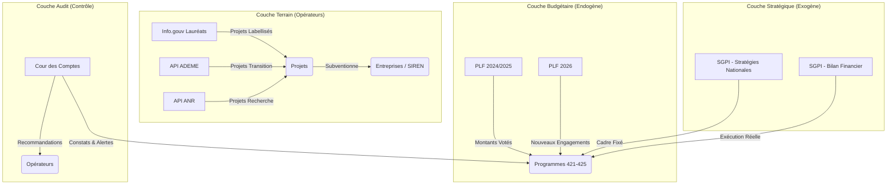

# 🎯 TODO : Intégration des Nouvelles Données dans le Frontend (Minerve) & Streamlit

Ce document décrit comment exploiter les **nouvelles données structurelles** (SGPI, PLF 2026, ADEME, ANR, Cour des Comptes, Info.gouv) introduites lors du dernier sprint, afin de les restituer proprement dans le Dashboard Streamlit de contrôle et le Frontend final React (Minerve).

---

## 1. 📊 Schéma des Nouvelles Données

Voici comment les nouvelles sources viennent s'emboîter dans le socle de données existant :

---

## 2. 📝 TODO : Améliorations du Dashboard Streamlit

Le Streamlit doit servir d'outil de **Data Quality Assurance (DQA)** pour l'équipe métier avant que les données ne partent dans l'application citoyenne.

### 2.1 Nouvelle Page : Suivi de l'Exécution Budgétaire
- [ ] Créer `app/pages/8_Execution_Budgetaire.py`.
- [ ] Mettre en parallèle les budgets **Votés** (issus de `budget_lines.json` et `programme_pluriannual_expenses.json`) avec les budgets **Exécutés** (issus de `france2030_financial_execution.json` du SGPI).
- [ ] Afficher une jauge (progress bar) : *Décaissements Réels / Enveloppe Globale*.

### 2.2 Enrichissement de la Page : Rapports Programmes
- [x] Modifier `app/pages/3_Rapport_Programme.py`.
- [x] Ajouter une section "Alertes & Audits" qui charge `audit_findings.json` et affiche les risques soulevés par la Cour des Comptes pour le programme sélectionné.
- [x] Afficher les "Stratégies Nationales d'Accélération" (SNA) liées à ce programme (issues de `acceleration_strategies.json`).

### 2.3 Amélioration de la Page : Data Quality
- [ ] Modifier `app/pages/4_Data_Quality.py`.
- [ ] Afficher spécifiquement la métrique `"unresolved_audit_recommendations"` (déjà préparée dans le code) avec un tableau listant ces recommandations (`audit_recommendations.json`).
- [ ] Afficher le taux de "Missing URLs" (traçabilité manquante) dans la page Data Quality.
- [ ] Ramener le taux de "Missing URLs" à zéro dans les données sources.

---

## 3. 🌐 TODO : Intégration dans le Frontend React (Minerve)

Le Frontend final doit exposer ces données au grand public / députés de manière claire, sans les noyer dans la donnée brute.

### 3.1 Nouveaux Contrats JSON (Endpoints API statiques)
Il faut modifier la passerelle d'export (`scripts/13_export_to_front_contract.py`) pour générer ces nouveaux fichiers consommables par le React :
- [ ] `dataset/reports/audit-reports.json` : Contiendra les constats de la Cour des comptes rattachés par `programmeCode`.
- [ ] `dataset/catalog/acceleration-strategies.json` : Liste des SNA pour le menu de navigation transversal.
- [ ] `dataset/sources/funded-projects.json` : Fusion dé-dupliquée des projets ADEME, ANR et Info.gouv, exposant clairement le `sourceUrl` pour prouver le financement au citoyen.

### 3.2 Composants React à développer (UI)
- [ ] **Composant `AuditAlert`** : Un bandeau d'alerte (jaune/orange) apparaissant en haut de la page d'un programme si la Cour des Comptes a émis un "Constat de Risque" (`findingType: "risk"`).
- [ ] **Composant `ExecutionGauge`** : Un graphique circulaire ou une barre de progression comparant l'enveloppe PLF votée vs. les décaissements SGPI réels.
- [ ] **Tableau `FundedProjectsTable`** : Un tableau paginé listant les entreprises financées (SIREN), avec une puce (Badge) indiquant l'opérateur source (ADEME, ANR, Info.gouv) et un lien cliquable sortant vers la preuve (`sourceUrl`).
- [ ] **Menu `Stratégies Nationales`** : Ajouter un filtre de navigation permettant de voir le budget non plus par Programme (424, 425...), mais par Stratégie (ex: "Hydrogène Décarboné").

### 3.3 Traçabilité absolue (Exigence UX)
- [ ] **Composant `SourceTooltip`** : Partout où une donnée chiffrée est affichée (un montant, un projet), ajouter une petite icône "Info" `(i)` qui, au survol, affiche la provenance de la donnée et inclut le lien direct (`datasetUrl` ou `resourceUrl`) vers data.gouv ou le PDF officiel.
